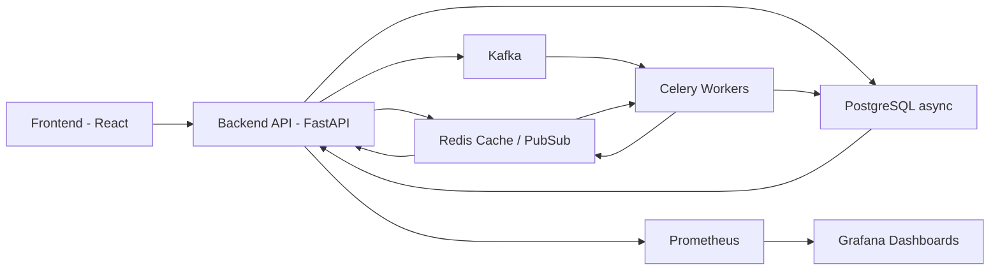

# PortoFino Portfolio Simulator

PortoFino is an advanced web platform for automated analysis and simulation of investment portfolios. It supports human-readable strategy inputs and is designed for expansion into a distributed system with asynchronous processing and microservices architecture. The platform integrates task queues and an event-driven Kafka pipeline for scalability and analytics.

---

## Table of Contents

- [Overview](#overview)  
- [Key Features](#key-features)  
- [Architecture](#architecture)  
- [Technology Stack](#technology-stack)  
- [Installation](#installation)  
- [Usage](#usage)  
- [API Endpoints](#api-endpoints)  
- [Testing](#testing)  
- [Monitoring](#monitoring)  
- [Contributing](#contributing)  
- [License](#license)  

---

## Overview

PortoFino enables users to:

- Define complex investment strategies using a human-readable command format.  
- Simulate portfolio performance over historical periods.  
- Generate analytical reports with portfolio metrics and Excel export.  
- Monitor simulations and reports in real-time via WebSockets.  
- Scale processing using asynchronous tasks, Celery workers, Kafka event streams, and Redis caching.

The platform demonstrates the implementation of production-grade distributed systems with FastAPI, React, Kafka, Celery, and PostgreSQL.

---

## Key Features

- **Portfolio Simulation**: Submit simulation tasks with user-defined commands specifying tickers, weights, and positions.  
- **History Management**: Paginated and detailed user simulation history.  
- **Report Generation**: XLS reports containing portfolio metrics, daily returns, cumulative returns, and key performance indicators (CAGR, Sharpe ratio, Max Drawdown).  
- **OAuth Authentication**: Google OAuth login and JWT-based session management.  
- **Real-time Updates**: WebSocket endpoints for monitoring simulation and report progress.  
- **Asynchronous Processing**: Celery workers handle CPU-intensive tasks and asynchronous event pipelines.  
- **Distributed Architecture**: Kafka topics for simulation, history, and report events.  
- **Observability**: Integrated Prometheus metrics and Grafana dashboards.

---

## Architecture



#### Description:

- **Frontend**: React-based UI communicates with FastAPI backend over HTTP and WebSockets for real-time simulation/report updates.
- **Backend API**: Handles requests, authentication, simulation and report task submission.
- **PostgreSQL**: Stores users, assets, simulation history, and refresh tokens.
- **Redis**: Data bus for caches intermediate data and manages pub/sub for WebSocket notifications.
- **Celery Workers**: Process synchronous tasks such as simulations and report generation.
- **Kafka Topics**: Event-driven message bus for simulation and report events.
- **Monitoring**: Prometheus collects metrics from services; Grafana visualizes them in dashboards.

---

## Technology Stack

| Category           | Technology                                                         | Purpose                                                          |
|:-------------------|:-------------------------------------------------------------------|:-----------------------------------------------------------------|
| Backend Framework  | FastAPI                                                            | REST and WebSocket APIs, asynchronous handling                   |
| Frontend Framework | React + TypeScript                                                 | Interactive UI for simulations and reports                       |
| Task Queue         | Celery                                                             | Synchronous task execution for simulations and report generation |
| Message Broker     | Kafka                                                              | Event-driven architecture for distributed processing             |
| Database           | PostgreSQL + SQLAlchemy                                            | Persistent storage of users, simulations, and historical data    |
| Caching            | Redis                                                              | Task results caching and pub/sub for WebSocket notifications     |
| Containerization   | Docker + Docker Compose                                            | Consistent deployment and local development environment          |
| Authentication     | OAuth (Google), JWT, Password Hashing (Argon2)                     | Secure user authentication and token management                  |
| Monitoring         | Prometheus, Grafana, Redis Exporter, Kafka Exporter, Node Exporter | Metrics collection, dashboards, and system monitoring            |
| Data Analysis      | Pandas, NumPy, yFinance                                            | Financial data processing and portfolio simulations              |
| Excel Export       | openpyxl                                                           | Report generation in XLSX format                                 |
| Testing            | Pytest, Pytest-Asyncio, Playwright                                 | Unit, integration, end-to-end testing                            |
| CI/CD              | GitHub Actions, Docker, .env, Linters                              | Integration and deployment Stack                                 |

---

## Installation

Prerequisites

- **Docker ≥ 20**
- **Docker Compose ≥ 2.0**
- **Node.js ≥ 20 (for frontend build)**

Steps

1. Clone the repository:

```
git clone <repo-url>
cd PortoFino
```

2. Configure environment variables:

```
cp .env .env-secret
# Edit .env with database, OAuth, and other settings
```

3. Build and start services:

```
docker compose up --build
```

Access services:

- **Backend API**: http://localhost:8000
- **Frontend UI**: http://localhost:5173
- **Grafana**: http://localhost:3000 (default credentials: admin/admin)
- **Prometheus**: http://localhost:9090

### Usage

- **Register or log in via the frontend.**
- **Submit simulation commands (e.g., AAPL-L-50% MSFT-L-50% 2020-01-01 2023-01-01).**
- **Monitor real-time progress via WebSocket connections.**
- **Download generated reports from the /report endpoint.**

---

## API Endpoints

| Endpoint                  | Method | Description                                          |
|:--------------------------|:-------|:-----------------------------------------------------|
| /auth/register            | POST   | Register a new user                                  |
| /auth/login               | POST   | Authenticate user and return access/refresh tokens   |
| /auth/logout              | POST   | Logout and revoke refresh token                      |
| /auth/refresh             | POST   | Refresh JWT access token                             |
| /auth/google/login        | GET    | Redirect to Google OAuth login                       |
| /auth/google/callback     | GET    | Handle Google OAuth callback                         |
| /simulate                 | POST   | Submit a new portfolio simulation task               |
| /history/                 | GET    | Paginated list of user simulation history            |
| /history/{simulation_id}  | GET    | Detailed simulation history by ID                    |
| /report                   | POST   | Create a report task from a simulation               |
| /ws/simulations/{task_id} | WS     | WebSocket endpoint for real-time simulation progress |
| /ws/reports/{task_id}     | WS     | WebSocket endpoint for real-time report progress     |
| /health                   | GET    | Health check endpoint                                |
| /metrics                  | GET    | Prometheus metrics endpoint                          |

## Testing

Backend
```
docker compose exec backend pytest -v
```
Frontend
```
docker compose exec frontend npm run test
```
E2E Tests
```
docker compose exec frontend npx playwright test
```

## Monitoring

- **Grafana dashboards available at http://localhost:3000.**
- **Prometheus metrics exposed at /metrics endpoint of the FastAPI backend.**
- **Redis, Kafka, and Node exporters included for system-level metrics.**

## Contributing

- **Use feature branches and submit pull requests.**
- **Ensure unit and integration tests cover new functionality.**
- **Follow code style using Black, isort, and Flake8.**

## License

PortoFino is distributed under the MIT License.